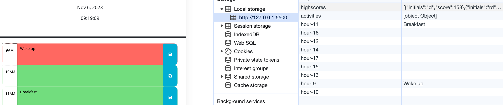

# Work-Day-Scheduler-Hw

## Description

The purpose of this project was to create a work day schedule for users so that depending on what time it is during a 9am-5pm schedule, they can input some type of activity they would like to do where that activity is saved and then stored into the local storage. The reason this was created was to make it easier for users organize their day and see what current time block they are in throughout the day. The way the schedule works is that when they click on the site, they can see the current day and then see what corresponding time block they are in. They can then input any acitivity for that time and refer to it later on. It solves the problem of functionality and being able to store any input you make so you can see what you have to do throughout the day in each hour time block based on what your current time is. I learned a lot about learning to write in jquery, using $(this), creating for loops, and playing around with the "application tab" to see what you've saved in the local storage.  

## Usage

Instructions for ![TimeBlock]: When you type an event into the current time block you are in (in this case 9am), you can click on the blue button after you've written your event to save that event. The green at 10am shows the future time. 
Instructions for ![InputAcitivity.LocalStorage]: After you've saved your event, you can see in the application tab that the event has been saved to the local storage and now persists. 

Link to live site: https://rosiedeng1.github.io/Work-Day-Scheduler-Hw/
## Credits

Creating a for loop using jquery: https://api.jquery.com/each/
How to get the parent of each elemenet: https://api.jquery.com/parent/
Creating a click event using jquery: https://www.w3schools.com/jquery/jquery_events.asp
https://api.jquery.com/prev/
For of loops using normal javascript: 
https://developer.mozilla.org/en-US/docs/Web/JavaScript/Reference/Statements/for...of

## License

Please refer to the LICENSE in the Repo. 